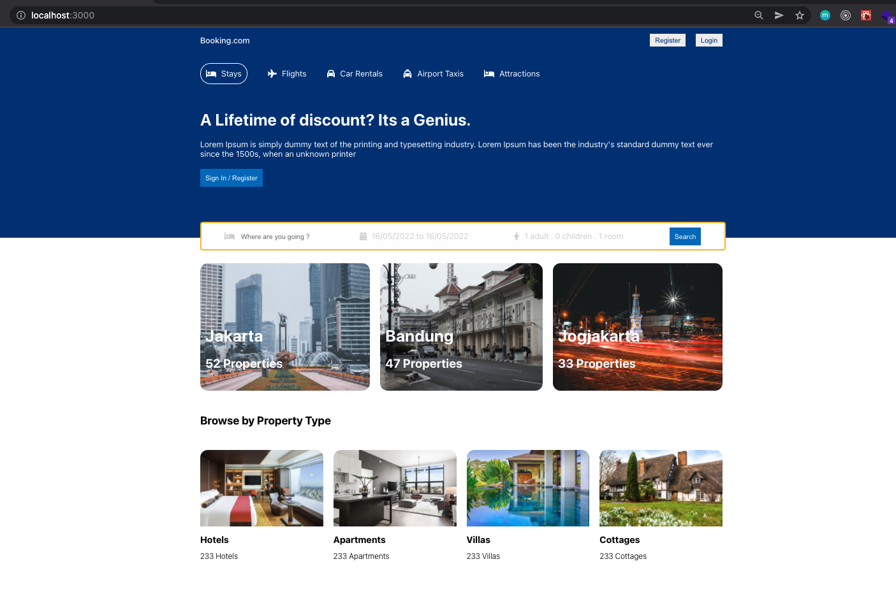
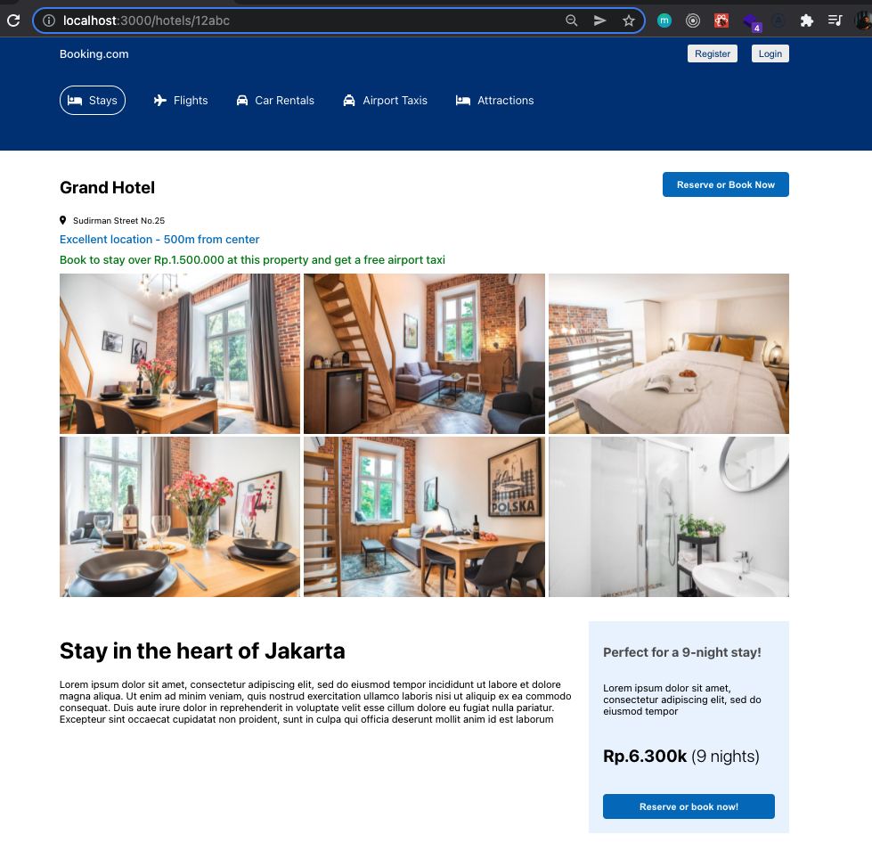

# Booking App

An exercise to the css skills. In this mini project, I tried to implement some css technique such as flex, z-index, etc. without any css libraries. It also backed by the react for the core components.
It also use express as the backend along with mongoDB. I use mongoose as object data modelling, jwt and bcrypt for hashing.

