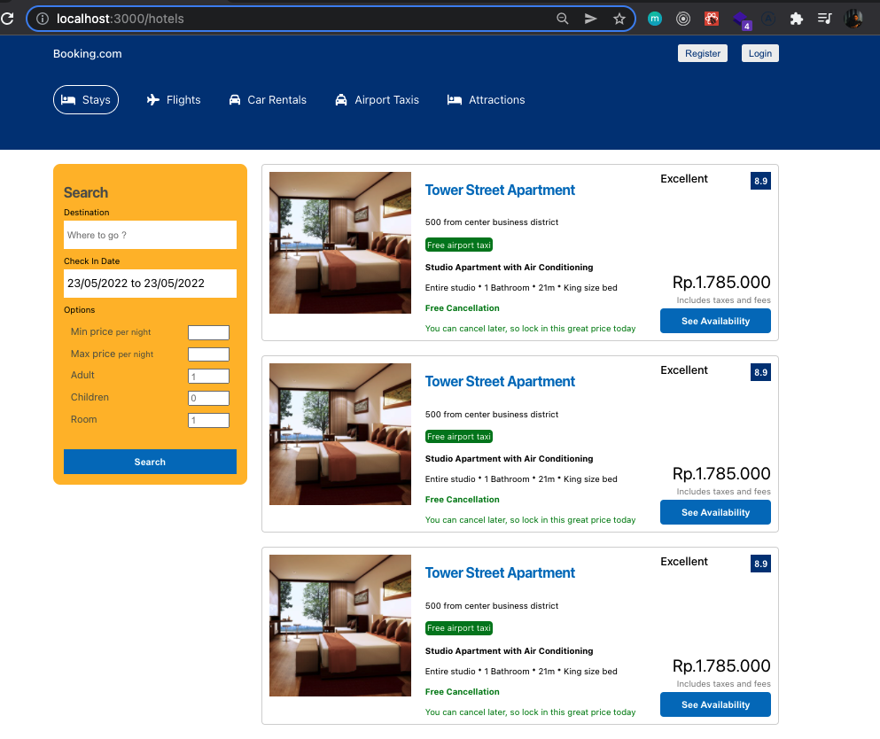

# Booking App

This is mainly to exercise the css skills. In this mini project, i tried to implement some css technique such as z index, flex, and etc without any css libraries. It also backed by the react for the core components

